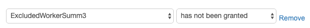

# Amazon Mechanical Turk Worker Monitor

The provided monitor automatically disqualifies workers who exceed a specific number of completed HITs.
This provides a guarantee that submissions are diverse as being completed by different workers.

## Installation

Download the repository and install the required package(s) using pip:

```
pip install -r requirements.txt
```


## Requirements
* Python3
* boto3


## Mechanical Turk Setup

If you have not setup your Mechanical Turk account, you might find helpful to follow [this guide](https://docs.aws.amazon.com/AWSMechTurk/latest/AWSMechanicalTurkGettingStartedGuide/SetUp.html)).
Once the setup is completed, create a qualification that will be used to blacklist workers when they exceed a threshold number of completed HITs.


Finally, you need to publish a batch of HITs that you would like to monitor.


## Run

To run the monitor you can use the command line as shown below:

```
python mt_worker_monitor.py --max_hits=10 --batch_id=YOUR_BATCH_ID --aws_access_key_id=YOUR_KEY_ID --aws_secret_access_key=YOUR_ACCESS_KEY --mturk_endpoint_url=ENDPOINT_URL --blacklist_qualification_id=QUALIFICATION_ID --sleep_time=120
```

The monitor will run until a manual termination.